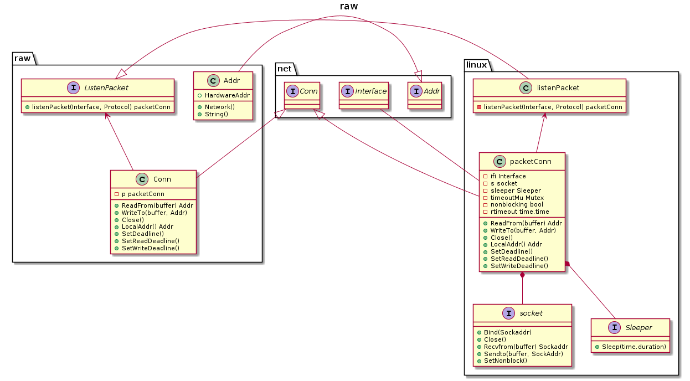

raw [](https://travis-ci.org/caser789/raw)
[](https://godoc.org/github.com/caser789/raw)
[](https://goreportcard.com/report/github.com/caser789/raw)
[](https://coveralls.io/r/caser789/raw?branch=master)
=====



```
@startuml

title raw

class raw.Addr {
    +HardwareAddr
    +Network()
    +String()
}

interface raw.ListenPacket {
    +listenPacket(Interface, Protocol) packetConn
}

class raw.Conn {
    -p packetConn
    +ReadFrom(buffer) Addr
    +WriteTo(buffer, Addr)
    +Close()
    +LocalAddr() Addr
    +SetDeadline()
    +SetReadDeadline()
    +SetWriteDeadline()
}

raw.ListenPacket <-- raw.Conn

interface linux.socket {
    +Bind(Sockaddr)
    +Close()
    +Recvfrom(buffer) Sockaddr
    +Sendto(buffer, SockAddr)
    +SetNonblock()
}

interface linux.Sleeper {
    +Sleep(time.duration)
}

class linux.packetConn {
    -ifi Interface
    -s socket
    -sleeper Sleeper
    -timeoutMu Mutex
    -nonblocking bool
    -rtimeout time.time
    +ReadFrom(buffer) Addr
    +WriteTo(buffer, Addr)
    +Close()
    +LocalAddr() Addr
    +SetDeadline()
    +SetReadDeadline()
    +SetWriteDeadline()
}


linux.packetConn *-- linux.Sleeper
linux.packetConn *-- linux.socket

class linux.listenPacket {
    -listenPacket(Interface, Protocol) packetConn
}

raw.ListenPacket <|-- linux.listenPacket
linux.listenPacket <-- linux.packetConn

interface net.Addr {}
interface net.Conn {}
interface net.Interface {}

net.Addr <|-- raw.Addr
net.Conn <|-- raw.Conn
net.Conn <|-- linux.packetConn

linux.packetConn -- net.Interface

@enduml
```
